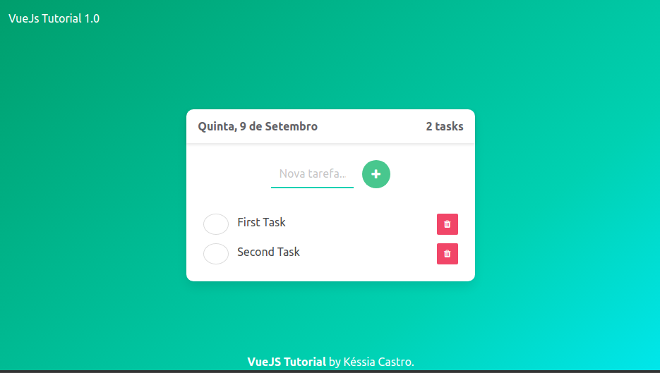
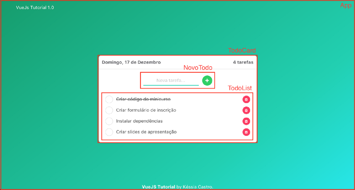

# todo-list

> A Vue.js project





## Build Setup

``` bash
# install dependencies
npm install

# serve with hot reload at localhost:8080
npm run dev

# build for production with minification
npm run build
```

For detailed explanation on how things work, consult the [docs for vue-loader](http://vuejs.github.io/vue-loader).


## References
[Vue.js Tutorial: Iniciando com componentes](https://medium.com/@kessiacastro/vue-js-tutorial-iniciando-com-componentes-4445b3eb0ffe)